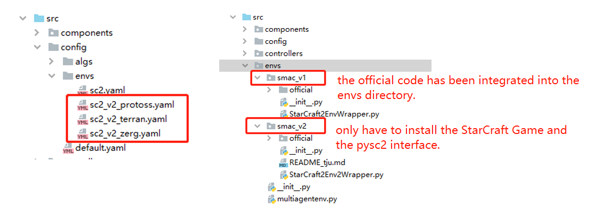
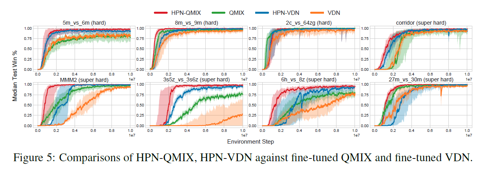
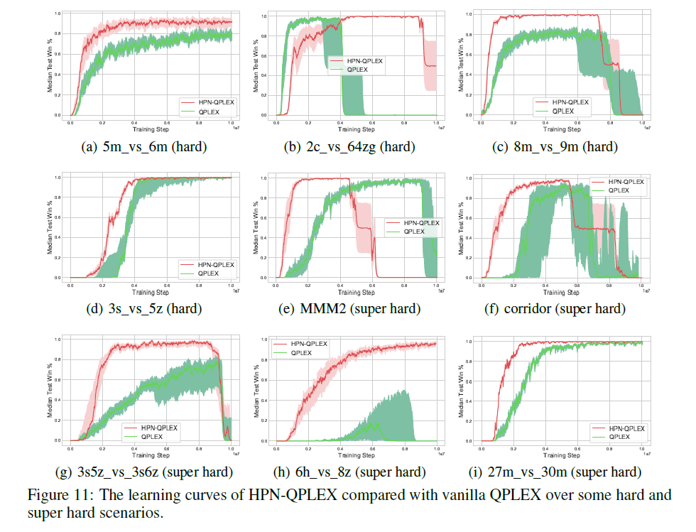
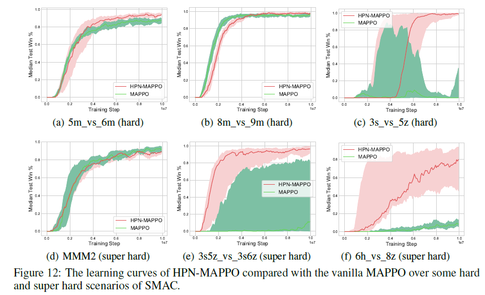
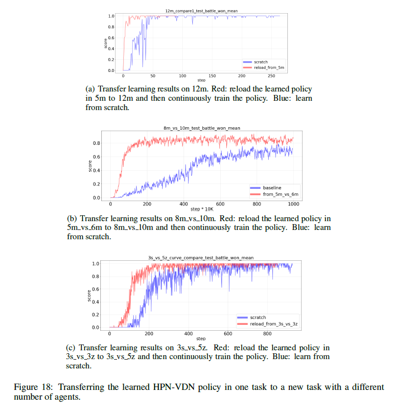
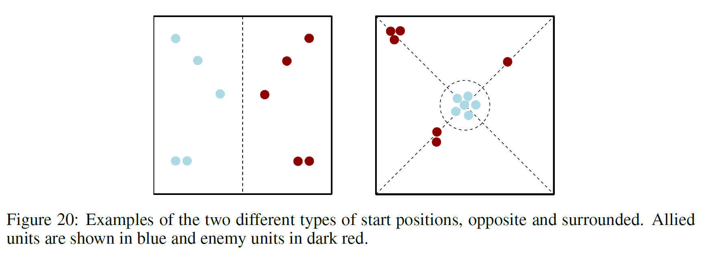
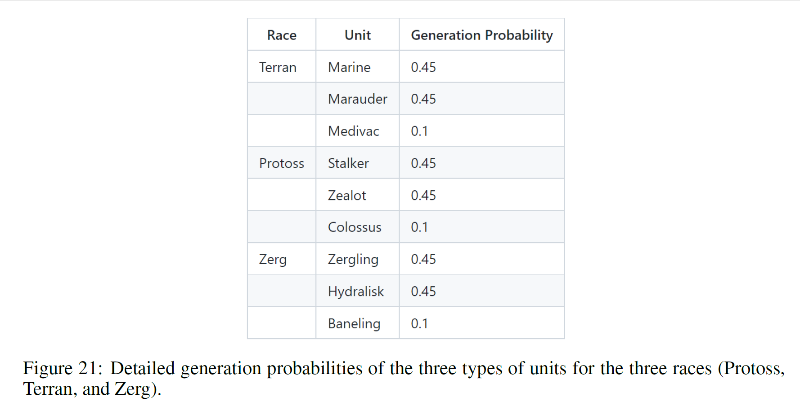
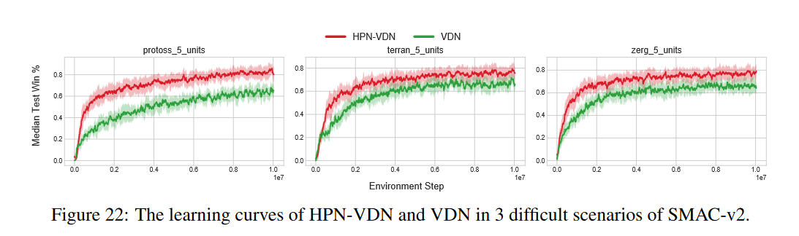

# [pymarl3](https://github.com/tjuHaoXiaotian/pymarl3): the source code of ICLR-2023 paper 
**[Boosting Multi-Agent Reinforcement Learning via Permutation Invariant and Permutation Equivariant Networks](https://openreview.net/pdf?id=OxNQXyZK-K8)**.

We extend [**pymarl2** (https://github.com/hijkzzz/pymarl2)](https://github.com/hijkzzz/pymarl2) to **pymarl3**, adding the support for the [SMAC-V2 environment](https://github.com/oxwhirl/smacv2)  and equipping the MARL algorithms with permutation invariance and permutation equivariance properties. 

## Key Features:
* (1) **Support both [SMAC-V1](https://github.com/oxwhirl/smac) and [SMAC-V2](https://github.com/oxwhirl/smacv2)** (without the need of installing each environment separately). 
  * 
* (2) Equip the MARL algorithms of [**pymarl2**](https://github.com/hijkzzz/pymarl2) with the **permutation invariance (PI) and permutation equivariance (PE)** properties. The proposed PI and PE model architectures **can be easily plugged into any existing MARL algorithms and boost their performance**.
* (3) :rocket: **The enhanced algorithm achieves State-Of-The-Art (SOTA) performance on SMAC-V1 and SMAC-V2** (without restricting the agent field-of-view and shooting range to a cone).

```
[2023-07 update]: Commit the support for SMAC-V2.
```

## 1. Model Architecture of Hyper Policy Network (HPN)


HPN incorporates [hypernetworks](https://arxiv.org/pdf/1609.09106) to generate different
weights s for different input
components s to improve representational capacity while ensuring the
same  always be assigned with the same
weight . The architecture of our HPN is shown in the above Figure (b). We
also take the ) as an example. The model mainly composes of two modules:

**Permutation Invariant Input Layer.**  [hypernetworks](https://arxiv.org/pdf/1609.09106) are a family of neural
architectures which use one network, known as hypernetwork, to generate the weights for another network. In our setting,
the hypernetwork is utilized to generate a different  for
each  of the input set . As
shown in above Figure (b),  (which can be viewed as a batch
of  s each of which is of
dimension , represented by different shades of blue) is firstly fed into a
shared hypernetwork (marked in yellow), whose input size is  and output size
is . Then, the corresponding outputs are reshaped
to  and serve as the submodule
weights s of the normal FC layer (see Figure (a)). Note that
different s will generate
different s and the same  will
always correspond to the same . Then,
each  is multiplied by  and all
multiplication results and the bias  are summed together to get the output.
Since each element  is processed separately by its
corresponding  and then merged by a permutation invariant 'sum' function,
the permutation invariance is reserved.

**Permutation Equivariance Output Layer.** Similarly, to keep the whole network permutation equivariance, the submodular
weights and bias of the agent-related actions in the output layer,
e.g.,  of SMAC, are also generated by a
hypernetwork. As mentioned above, the input  and
output  of the hypernetwork always correspond one-to-one, so the input order
change will result in the same output order change, thus achieving permutation equivariance.

We emphasize that HPN is a general design and can be easily integrated into existing MARL algorithms (
e.g., [VDN](https://arxiv.org/pdf/1706.05296?ref=https://githubhelp.com)
, [QMIX](http://proceedings.mlr.press/v80/rashid18a/rashid18a.pdf)
, [MADDPG](https://proceedings.neurips.cc/paper/2017/file/68a9750337a418a86fe06c1991a1d64c-Paper.pdf)
, [MAPPO](https://arxiv.org/pdf/2103.01955?ref=https://githubhelp.com)) to boost the learning speed as well as the
converged performance. All parameters of HPN are simply trained end-to-end with backpropagation according to the
corresponding RL loss function.

## 2. Experimental Results on SAMC-V1

We mainly evaluate our methods on the challenging StarCraft II micromanagement
benchmark [(SMAC)](https://github.com/oxwhirl/smac).

****

```
StarCraft 2 version: SC2.4.10. difficulty: 7.
```

| Senarios       | Difficulty |               HPN-QMIX              |
|----------------|:----------:|:----------------------------------:|
| 8m_vs_9m           |  Hard |          **100%**          |
| 5m_vs_6m     |    Hard    |          **100%**          |
| 3s_vs_5z     |    Hard    |          **100%**          |
| bane_vs_bane |    Hard    |          **100%**          |
| 2c_vs_64zg   |    Hard    |          **100%**          |
| corridor       | Super Hard |          **100%**          |
| MMM2           | Super Hard |          **100%**          |
| 3s5z_vs_3s6z | Super Hard |**100%** |
| 27m_vs_30m   | Super Hard |          **100%**          |
| 6h_vs_8z     | Super Hard |  **98%**  |

### 2.1 Applying HPN to fine-tuned VDN and QMIX.



### 2.2 Applying HPN to QPLEX and MAPPO.




### 2.3 Comparison with baselines considering permutation invariance or permutation equivariance.


### 2.4 Transfer results.

Apart from achieving PI and PE, another benefit of HPN is that it can naturally handle variable numbers of inputs and
outputs. Therefore, as also stated in the conclusion section, HPN can be potentially used to design more efficient
multitask learning and transfer learning algorithms. For example, we can directly transfer the learned HPN policy in one
task to new tasks with different numbers of agents and improve the learning efficiency in the new tasks. Transfer
learning results of 5m → 12m, 5m_vs_6m → 8m_vs_10m, 3s_vs_3z → 3s_vs_5z are shown in the following figures. We see that
the previously trained HPN policies can serve as better initialization policies for new tasks.


## 3. Experimental Results on SAMC-V2

### 3.1 Changes of SMAC-V2.

SMAC-v2 makes three major changes to SMAC: randomising start positions, randomising unit types, and restricting the
agent field-of-view and shooting range to a cone. These first two changes increase more randomness to challenge
contemporary MARL algorithms. The third change makes features harder to infer and adds the challenge that agents must
actively gather information (require more efficient exploration). **Since our target is not to design more efficient
exploration algorithms, we keep the field-of-view and attack of the agents a full circle as in SMAC-V1.**

* **Random Start Positions:**  Random start positions come in two different types. First, there is the `surrounded`
  type, where the allied units are spawned in the middle of the map, and surrounded by enemy units. This challenges the
  allied units to overcome the enemies approach from multiple angles at once. Secondly, there are the `reflect_position`
  scenarios. These randomly select positions for the allied units, and then reflect their positions in the midpoint of
  the map to get the enemy spawn positions. Examples are shown in the figure
  below.  
* **Random Unit Types:**  Battles in SMAC-V2 do not always feature units of the same type each time, as they did in
  SMAC. Instead, units are spawned randomly according to certain pre-fixed probabilities. Units in StarCraft II are
  split up into different races. Units from different races cannot be on the same team. For each of the three races (
  Protoss, Terran, and Zerg), SMAC-V2 uses three unit types. Detailed generation probabilities are shown in the figure
  below. 

### 3.2 Experimental Results.

**Our HPN can naturally handle the two types of new challenges.** Thanks to the PI and PE properties, our HPN is more
robust to the randomly changed start positions of the entities. Thanks to the entity-wise modeling and using
hypernetwork to generate a customized `weight matrix` for each type of unit, HPN can handle the randomly generated unit
types as well. The comparisons of HPN-VDN with VDN on three difficult scenarios across the three races (Protoss, Terran,
and Zerg) are shown in the figures below. Results show that our HPN significantly improves the sample efficiency and the
converged test win rates of the baseline VDN.


## 4. How to use the code?

### 4.1 Install this repository.
```shell
# Step-1: Clone the repository and enter the folder.
git clone git@github.com:tjuHaoXiaotian/pymarl3.git
cd pymarl3

# Step-2: Install StarCraftII add the custom maps.
chmod +x install_sc2.sh
./install_sc2.sh

# Step-3: Install PyTorch and other Python packages.
chmod +x install_dependencies.sh
./install_dependencies.sh
```

### 4.2 Detailed command lines to reproduce all experimental results (on SMAC-V1).

```shell
# For SMAC, take the hpn_qmix, qmix, hpn_qplex and qplex over all hard and super-hard scenarios for example.

# 5m_vs_6m
CUDA_VISIBLE_DEVICES="0" python src/main.py --config=hpn_qmix --env-config=sc2 with env_args.map_name=5m_vs_6m obs_agent_id=True obs_last_action=False runner=parallel batch_size_run=8 buffer_size=5000 t_max=10050000 epsilon_anneal_time=100000 batch_size=128 td_lambda=0.6
CUDA_VISIBLE_DEVICES="0" python src/main.py --config=qmix --env-config=sc2 with env_args.map_name=5m_vs_6m obs_agent_id=True obs_last_action=True runner=parallel batch_size_run=8 buffer_size=5000 t_max=10050000 epsilon_anneal_time=100000 batch_size=128 td_lambda=0.6
CUDA_VISIBLE_DEVICES="0" python src/main.py --config=hpn_qplex --env-config=sc2 with env_args.map_name=5m_vs_6m obs_agent_id=True obs_last_action=False runner=parallel batch_size_run=8 buffer_size=5000 t_max=10050000 epsilon_anneal_time=100000 batch_size=128 td_lambda=0.6
CUDA_VISIBLE_DEVICES="0" python src/main.py --config=qplex --env-config=sc2 with env_args.map_name=5m_vs_6m obs_agent_id=True obs_last_action=True runner=parallel batch_size_run=8 buffer_size=5000 t_max=10050000 epsilon_anneal_time=100000 batch_size=128 td_lambda=0.6

# 3s5z_vs_3s6z
CUDA_VISIBLE_DEVICES="0" python src/main.py --config=hpn_qmix --env-config=sc2 with env_args.map_name=3s5z_vs_3s6z obs_agent_id=True obs_last_action=False runner=parallel batch_size_run=4 buffer_size=5000 t_max=10050000 epsilon_anneal_time=100000 batch_size=128 td_lambda=0.6
CUDA_VISIBLE_DEVICES="0" python src/main.py --config=qmix --env-config=sc2 with env_args.map_name=3s5z_vs_3s6z obs_agent_id=True obs_last_action=True runner=parallel batch_size_run=4 buffer_size=5000 t_max=10050000 epsilon_anneal_time=100000 batch_size=128 td_lambda=0.6
CUDA_VISIBLE_DEVICES="0" python src/main.py --config=hpn_qplex --env-config=sc2 with env_args.map_name=3s5z_vs_3s6z obs_agent_id=True obs_last_action=False runner=parallel batch_size_run=4 buffer_size=5000 t_max=10050000 epsilon_anneal_time=100000 batch_size=128 td_lambda=0.6
CUDA_VISIBLE_DEVICES="0" python src/main.py --config=qplex --env-config=sc2 with env_args.map_name=3s5z_vs_3s6z obs_agent_id=True obs_last_action=True runner=parallel batch_size_run=4 buffer_size=5000 t_max=10050000 epsilon_anneal_time=100000 batch_size=128 td_lambda=0.6

# 6h_vs_8z
CUDA_VISIBLE_DEVICES="0" python src/main.py --config=hpn_qmix --env-config=sc2 with env_args.map_name=6h_vs_8z obs_agent_id=True obs_last_action=False runner=parallel batch_size_run=8 buffer_size=5000 t_max=10050000 epsilon_anneal_time=500000 batch_size=128 td_lambda=0.3 hpn_head_num=2
CUDA_VISIBLE_DEVICES="0" python src/main.py --config=qmix --env-config=sc2 with env_args.map_name=6h_vs_8z obs_agent_id=True obs_last_action=True runner=parallel batch_size_run=8 buffer_size=5000 t_max=10050000 epsilon_anneal_time=500000 batch_size=128 td_lambda=0.3 hpn_head_num=2
CUDA_VISIBLE_DEVICES="0" python src/main.py --config=hpn_qplex --env-config=sc2 with env_args.map_name=6h_vs_8z obs_agent_id=True obs_last_action=False runner=parallel batch_size_run=8 buffer_size=5000 t_max=10050000 epsilon_anneal_time=500000 batch_size=128 td_lambda=0.3 hpn_head_num=2
CUDA_VISIBLE_DEVICES="0" python src/main.py --config=qplex --env-config=sc2 with env_args.map_name=6h_vs_8z obs_agent_id=True obs_last_action=True runner=parallel batch_size_run=8 buffer_size=5000 t_max=10050000 epsilon_anneal_time=500000 batch_size=128 td_lambda=0.3 hpn_head_num=2

# 8m_vs_9m
CUDA_VISIBLE_DEVICES="0" python src/main.py --config=hpn_qmix --env-config=sc2 with env_args.map_name=8m_vs_9m obs_agent_id=True obs_last_action=False runner=parallel batch_size_run=8 buffer_size=5000 t_max=10050000 epsilon_anneal_time=100000 batch_size=128 td_lambda=0.6
CUDA_VISIBLE_DEVICES="0" python src/main.py --config=qmix --env-config=sc2 with env_args.map_name=8m_vs_9m obs_agent_id=True obs_last_action=True runner=parallel batch_size_run=8 buffer_size=5000 t_max=10050000 epsilon_anneal_time=100000 batch_size=128 td_lambda=0.6
CUDA_VISIBLE_DEVICES="0" python src/main.py --config=hpn_qplex --env-config=sc2 with env_args.map_name=8m_vs_9m obs_agent_id=True obs_last_action=False runner=parallel batch_size_run=8 buffer_size=5000 t_max=10050000 epsilon_anneal_time=100000 batch_size=128 td_lambda=0.6
CUDA_VISIBLE_DEVICES="0" python src/main.py --config=qplex --env-config=sc2 with env_args.map_name=8m_vs_9m obs_agent_id=True obs_last_action=True runner=parallel batch_size_run=8 buffer_size=5000 t_max=10050000 epsilon_anneal_time=100000 batch_size=128 td_lambda=0.6

# 3s_vs_5z
CUDA_VISIBLE_DEVICES="0" python src/main.py --config=hpn_qmix --env-config=sc2 with env_args.map_name=3s_vs_5z obs_agent_id=True obs_last_action=False runner=parallel batch_size_run=8 buffer_size=5000 t_max=10050000 epsilon_anneal_time=100000 batch_size=128 td_lambda=0.6 hpn_head_num=2
CUDA_VISIBLE_DEVICES="0" python src/main.py --config=qmix --env-config=sc2 with env_args.map_name=3s_vs_5z obs_agent_id=True obs_last_action=True runner=parallel batch_size_run=8 buffer_size=5000 t_max=10050000 epsilon_anneal_time=100000 batch_size=128 td_lambda=0.6 hpn_head_num=2
CUDA_VISIBLE_DEVICES="0" python src/main.py --config=hpn_qplex --env-config=sc2 with env_args.map_name=3s_vs_5z obs_agent_id=True obs_last_action=False runner=parallel batch_size_run=8 buffer_size=5000 t_max=10050000 epsilon_anneal_time=100000 batch_size=128 td_lambda=0.6 hpn_head_num=2
CUDA_VISIBLE_DEVICES="0" python src/main.py --config=qplex --env-config=sc2 with env_args.map_name=3s_vs_5z obs_agent_id=True obs_last_action=True runner=parallel batch_size_run=8 buffer_size=5000 t_max=10050000 epsilon_anneal_time=100000 batch_size=128 td_lambda=0.6 hpn_head_num=2

# corridor
CUDA_VISIBLE_DEVICES="0" python src/main.py --config=hpn_qmix --env-config=sc2 with env_args.map_name=corridor obs_agent_id=True obs_last_action=False runner=parallel batch_size_run=8 buffer_size=5000 t_max=10050000 epsilon_anneal_time=100000 batch_size=128 td_lambda=0.6
CUDA_VISIBLE_DEVICES="0" python src/main.py --config=qmix --env-config=sc2 with env_args.map_name=corridor obs_agent_id=True obs_last_action=True runner=parallel batch_size_run=8 buffer_size=5000 t_max=10050000 epsilon_anneal_time=100000 batch_size=128 td_lambda=0.6
CUDA_VISIBLE_DEVICES="0" python src/main.py --config=hpn_qplex --env-config=sc2 with env_args.map_name=corridor obs_agent_id=True obs_last_action=False runner=parallel batch_size_run=8 buffer_size=5000 t_max=10050000 epsilon_anneal_time=100000 batch_size=128 td_lambda=0.6
CUDA_VISIBLE_DEVICES="0" python src/main.py --config=qplex --env-config=sc2 with env_args.map_name=corridor obs_agent_id=True obs_last_action=True runner=parallel batch_size_run=8 buffer_size=5000 t_max=10050000 epsilon_anneal_time=100000 batch_size=128 td_lambda=0.6

# MMM2
CUDA_VISIBLE_DEVICES="0" python src/main.py --config=hpn_qmix --env-config=sc2 with env_args.map_name=MMM2 obs_agent_id=True obs_last_action=False runner=parallel batch_size_run=8 buffer_size=5000 t_max=10050000 epsilon_anneal_time=100000 batch_size=128 td_lambda=0.6
CUDA_VISIBLE_DEVICES="0" python src/main.py --config=qmix --env-config=sc2 with env_args.map_name=MMM2 obs_agent_id=True obs_last_action=True runner=parallel batch_size_run=8 buffer_size=5000 t_max=10050000 epsilon_anneal_time=100000 batch_size=128 td_lambda=0.6
CUDA_VISIBLE_DEVICES="0" python src/main.py --config=hpn_qplex --env-config=sc2 with env_args.map_name=MMM2 obs_agent_id=True obs_last_action=False runner=parallel batch_size_run=8 buffer_size=5000 t_max=10050000 epsilon_anneal_time=100000 batch_size=128 td_lambda=0.6
CUDA_VISIBLE_DEVICES="0" python src/main.py --config=qplex --env-config=sc2 with env_args.map_name=MMM2 obs_agent_id=True obs_last_action=True runner=parallel batch_size_run=8 buffer_size=5000 t_max=10050000 epsilon_anneal_time=100000 batch_size=128 td_lambda=0.6

# 27m_vs_30m
CUDA_VISIBLE_DEVICES="0" python src/main.py --config=hpn_qmix --env-config=sc2 with env_args.map_name=27m_vs_30m obs_agent_id=True obs_last_action=False runner=parallel batch_size_run=8 buffer_size=5000 t_max=10050000 epsilon_anneal_time=100000 batch_size=128 td_lambda=0.6
CUDA_VISIBLE_DEVICES="0" python src/main.py --config=qmix --env-config=sc2 with env_args.map_name=27m_vs_30m obs_agent_id=True obs_last_action=True runner=parallel batch_size_run=8 buffer_size=5000 t_max=10050000 epsilon_anneal_time=100000 batch_size=128 td_lambda=0.6
CUDA_VISIBLE_DEVICES="0" python src/main.py --config=hpn_qplex --env-config=sc2 with env_args.map_name=27m_vs_30m obs_agent_id=True obs_last_action=False runner=parallel batch_size_run=8 buffer_size=5000 t_max=10050000 epsilon_anneal_time=100000 batch_size=128 td_lambda=0.6
CUDA_VISIBLE_DEVICES="0" python src/main.py --config=qplex --env-config=sc2 with env_args.map_name=27m_vs_30m obs_agent_id=True obs_last_action=True runner=parallel batch_size_run=8 buffer_size=5000 t_max=10050000 epsilon_anneal_time=100000 batch_size=128 td_lambda=0.6

# 2c_vs_64zg
CUDA_VISIBLE_DEVICES="0" python src/main.py --config=hpn_qmix --env-config=sc2 with env_args.map_name=2c_vs_64zg obs_agent_id=True obs_last_action=False runner=parallel batch_size_run=8 buffer_size=5000 t_max=10050000 epsilon_anneal_time=100000 batch_size=128 td_lambda=0.6
CUDA_VISIBLE_DEVICES="0" python src/main.py --config=qmix --env-config=sc2 with env_args.map_name=2c_vs_64zg obs_agent_id=True obs_last_action=True runner=parallel batch_size_run=8 buffer_size=5000 t_max=10050000 epsilon_anneal_time=100000 batch_size=128 td_lambda=0.6
CUDA_VISIBLE_DEVICES="0" python src/main.py --config=hpn_qplex --env-config=sc2 with env_args.map_name=2c_vs_64zg obs_agent_id=True obs_last_action=False runner=parallel batch_size_run=8 buffer_size=5000 t_max=10050000 epsilon_anneal_time=100000 batch_size=128 td_lambda=0.6
CUDA_VISIBLE_DEVICES="0" python src/main.py --config=qplex --env-config=sc2 with env_args.map_name=2c_vs_64zg obs_agent_id=True obs_last_action=True runner=parallel batch_size_run=8 buffer_size=5000 t_max=10050000 epsilon_anneal_time=100000 batch_size=128 td_lambda=0.6

# bane_vs_bane
CUDA_VISIBLE_DEVICES="0" python src/main.py --config=hpn_qmix --env-config=sc2 with env_args.map_name=bane_vs_bane obs_agent_id=True obs_last_action=False runner=parallel batch_size_run=8 buffer_size=5000 t_max=10050000 epsilon_anneal_time=100000 batch_size=128 td_lambda=0.6
CUDA_VISIBLE_DEVICES="0" python src/main.py --config=qmix --env-config=sc2 with env_args.map_name=bane_vs_bane obs_agent_id=True obs_last_action=True runner=parallel batch_size_run=8 buffer_size=5000 t_max=10050000 epsilon_anneal_time=100000 batch_size=128 td_lambda=0.6
CUDA_VISIBLE_DEVICES="0" python src/main.py --config=hpn_qplex --env-config=sc2 with env_args.map_name=bane_vs_bane obs_agent_id=True obs_last_action=False runner=parallel batch_size_run=8 buffer_size=5000 t_max=10050000 epsilon_anneal_time=100000 batch_size=128 td_lambda=0.6
CUDA_VISIBLE_DEVICES="0" python src/main.py --config=qplex --env-config=sc2 with env_args.map_name=bane_vs_bane obs_agent_id=True obs_last_action=True runner=parallel batch_size_run=8 buffer_size=5000 t_max=10050000 epsilon_anneal_time=100000 batch_size=128 td_lambda=0.6
```

### 4.3 Detailed command lines to reproduce the experimental results (on SMAC-V2).

```shell
#%%%%%%%%%%%%%%%%%%% sc2_v2_terran %%%%%%%%%%%%%%%%%%%%%
CUDA_VISIBLE_DEVICES="1" python src/main.py --config=hpn_vdn --env-config=sc2_v2_terran with obs_agent_id=True obs_last_action=False runner=parallel batch_size_run=8 buffer_size=5000 t_max=10050000 epsilon_anneal_time=100000 batch_size=128 td_lambda=0.6 mixer=vdn

CUDA_VISIBLE_DEVICES="0" python src/main.py --config=vdn --env-config=sc2_v2_terran with obs_agent_id=True obs_last_action=False runner=parallel batch_size_run=8 buffer_size=5000 t_max=10050000 epsilon_anneal_time=100000 batch_size=128 td_lambda=0.6 mixer=vdn

#%%%%%%%%%%%%%%%%%%% sc2_v2_protoss %%%%%%%%%%%%%%%%%%%%%
CUDA_VISIBLE_DEVICES="0" python src/main.py --config=hpn_vdn --env-config=sc2_v2_protoss with obs_agent_id=True obs_last_action=False runner=parallel batch_size_run=8 buffer_size=5000 t_max=10050000 epsilon_anneal_time=100000 batch_size=128 td_lambda=0.6 mixer=vdn

CUDA_VISIBLE_DEVICES="1" python src/main.py --config=vdn --env-config=sc2_v2_protoss with obs_agent_id=True obs_last_action=False runner=parallel batch_size_run=8 buffer_size=5000 t_max=10050000 epsilon_anneal_time=100000 batch_size=128 td_lambda=0.6 mixer=vdn

#%%%%%%%%%%%%%%%%%%% sc2_v2_zerg %%%%%%%%%%%%%%%%%%%%%
CUDA_VISIBLE_DEVICES="1" python src/main.py --config=hpn_vdn --env-config=sc2_v2_zerg with obs_agent_id=True obs_last_action=False runner=parallel batch_size_run=8 buffer_size=5000 t_max=10050000 epsilon_anneal_time=100000 batch_size=128 td_lambda=0.6 mixer=vdn

CUDA_VISIBLE_DEVICES="0" python src/main.py --config=vdn --env-config=sc2_v2_zerg with obs_agent_id=True obs_last_action=False runner=parallel batch_size_run=8 buffer_size=5000 t_max=10050000 epsilon_anneal_time=100000 batch_size=128 td_lambda=0.6 mixer=vdn

```

## 5. Citation

```text
@article{hao2022api,
  title={Boosting Multi-Agent Reinforcement Learning via Permutation Invariant and Permutation Equivariant Networks},
  author={Hao Jianye, Hao Xiaotian, Mao Hangyu, Wang Weixun, Yang Yaodong, Li Dong, Zheng Yan, Wang Zhen},
  journal={The Eleventh International Conference on Learning Representations.},
  year={2022}
}
```


