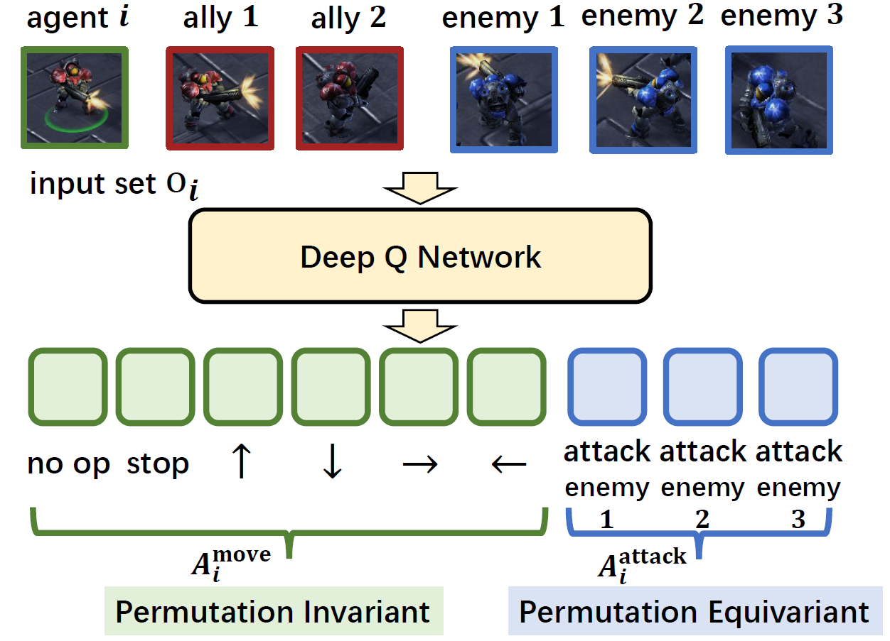
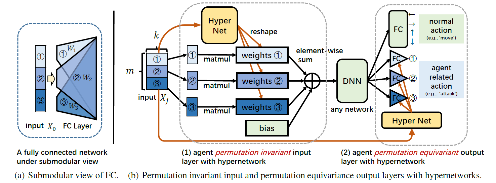
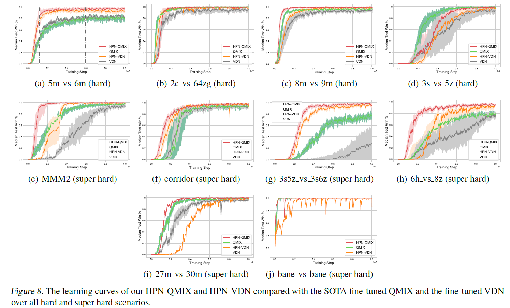
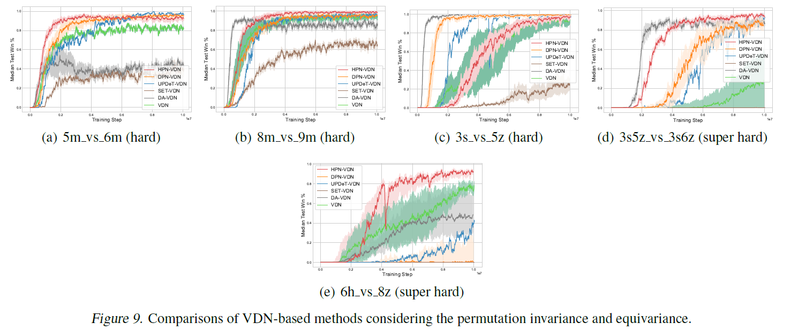
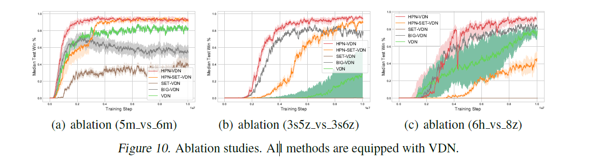

# API: Boosting Multi-Agent Reinforcement Learning via Agent-Permutation-Invariant Networks

Open-source code for [API: Boosting Multi-Agent Reinforcement Learning via Agent-Permutation-Invariant Networks](https://arxiv.org/abs/xxxxx).

[TOC]

## 1. Motivation

### 1.1  Permutation Invariance and Equivariance


**Permutation Invariant Function.** A function  where  of size ) is a set consisting of  components (each of which is of dimension ), is said to be permutation invariant if permutation of input components does not change the output of the function. Mathematically, =f(M\left[x_1,x_2,\ldots\text{}x_m\right]^\mathsf{T})), where  is the permutation matrix of size ), which is a binary matrix that has exactly a single unit value in every row and column and zeros everywhere else.

**Permutation Equivariant Function.** Similarly, a function  is permutation equivariant if permutation of input components permutes the output components with the same permutation . Mathematically, =M\left[y_1,y_2,\ldots\text{}y_m\right]^\mathsf{T}).

### 1.2 Why Permutation Invariant Matters?

In MARL, the environments typically consist of  components, including  learning agents and  non-player characters. Therefore, the states, observations are factorizable as sets of  components , where each component  represents an atomic semantic meaning (e.g., agent 's features) whose dimension is . Because shuffling the order of  components does not change the information of the set, one would expect many functions, e.g., the policy function ), possess permutation invariance and permutation equivariance. These properties can be exploited to design more efficient MARL algorithms, especially when the  components are homogeneous, i.e., semantically identical (belonging to the same type, having identical feature spaces, action spaces and reward functions).

Taking ) as an example, the input is the observation , and the outputs are Q-values of all actions in . Since the  components are homogeneous, they have the same feature space, i.e., . Thus, the size of an **fixedly ordered representation** of  is . In contrast, using a **permutation invariant representation**, i.e., removing the influence of the input order, could reduce the size of the observation space by a factor of . As the number of homogeneous components increases, the removal of these redundancies results in a much smaller search space, upon which we could more easily learn a policy.

Our objective is to design more flexible **Agent Permutation Invariant** (**API**) and **Agent Permutation Equivariant** (**APE**) models to greatly reduce the sample complexity of MARL algorithms. Also taking ) as the example, if there is a direct correspondence between the action Q-value in output and the component in input , then ) for these actions should be permutation equivariant; otherwise, ) should be permutation invariant.



Note that this is very common for many multi-agent settings. For example, as illustrated in the above Figure, in the challenging [StarCraft II micromanagement benchmark (SMAC)](https://github.com/oxwhirl/smac), the input set  could be divided into 2 groups: an ally group  and an enemy group . The output Q-values of the actions could be divided into 2 groups as well: Q-values for move actions , i.e., , and attack actions . Since there is a one-to-one correspondence between the elements in  and , the Q-values of  should be equivariant to the permutations of , while the Q-values of  should be invariant to the permutations of the whole set . Overall, a desired model of ) should be both permutation invariant and permutation equivariance.


## 2. Model Architecture of API-HyPerNetwork (API-HPN)



API-HPN incorporates [hypernetworks](https://arxiv.org/pdf/1609.09106) to generate different weights s for different input components s to improve representational capacity while ensuring the same  always be assigned with the same weight . The architecture of our API-HPN is shown in the above Figure (b). We also take the ) as an example. The model mainly composes of two modules:

**Agent Permutation Invariant Input Layer.**  [hypernetworks](https://arxiv.org/pdf/1609.09106) are a family of neural architectures which use one network, known as hypernetwork, to generate the weights for another network. In our setting, the hypernetwork is utilized to generate a different  for each  of the input set . As shown in above Figure (b),  (which can be viewed as a batch of  s each of which is of dimension , represented by different shades of blue) is firstly fed into a shared hypernetwork (marked in yellow), whose input size is  and output size is . Then, the corresponding outputs are reshaped to  and serve as the submodule weights s of the normal FC layer (see Figure (a)). Note that different s will generate different s and the same  will always correspond to the same . Then, each  is multiplied by  and all multiplication results and the bias  are summed together to get the output. Since each element  is processed separately by its corresponding  and then merged by a permutation invariant 'sum' function, the permutation invariance is reserved.

**Agent Permutation Equivariance Output Layer.** Similarly, to keep the whole network permutation equivariance, the submodular weights and bias of the agent-related actions in the output layer, e.g.,  of SMAC, are also generated by a hypernetwork. As mentioned above, the input  and output  of the hypernetwork always correspond one-to-one, so the input order change will result in the same output order change, thus achieving permutation equivariance.

We emphasize that API-HPN is a general design and can be easily integrated into existing MARL algorithms (e.g., [VDN](https://arxiv.org/pdf/1706.05296?ref=https://githubhelp.com), [QMIX](http://proceedings.mlr.press/v80/rashid18a/rashid18a.pdf), [MADDPG](https://proceedings.neurips.cc/paper/2017/file/68a9750337a418a86fe06c1991a1d64c-Paper.pdf), [MAPPO](https://arxiv.org/pdf/2103.01955?ref=https://githubhelp.com)) to boost the learning speed as well as the converged performance. All parameters of API-HPN are simply trained end-to-end with backpropagation according to the corresponding RL loss function.


## 3. Experiments

### 3.1 Experimental Setups

We mainly evaluate our methods in the challenging StarCraft II micromanagement benchmark [(SMAC)](https://github.com/oxwhirl/smac).

****

```
StarCraft 2 version: SC2.4.10. difficulty: 7.
```
### 3.2 Evaluation Metric

### 3.3 Code Implementations and Structure

### 3.4 Results

#### 3.4.1 Comparison with previous SOTA



#### 3.4.2 Comparison with baselines considering permutation invariance and permutation equivariant property



#### 3.4.3 Ablation Studies




| Senarios       | Difficulty |               API-QMIX              |
|----------------|:----------:|:----------------------------------:|
| 8m_vs_9m           |  Hard |          **100%**          |
| 5m_vs_6m     |    Hard    |          **100%**          |
| 3s_vs_5z     |    Hard    |          **100%**          |
| bane_vs_bane |    Hard    |          **100%**          |
| 2c_vs_64zg   |    Hard    |          **100%**          |
| corridor       | Super Hard |          **100%**          |
| MMM2           | Super Hard |          **100%**          |
| 3s5z_vs_3s6z | Super Hard |**100%** |
| 27m_vs_30m   | Super Hard |          **100%**          |
| 6h_vs_8z     | Super Hard |  **98%**  |


## 4. How to use the code?

### 4.1 Detailed Command line tool to reproduce all experimental results


**Run an experiment**

```shell
# For SMAC, take the 5m_vs_6m scenario for example.
CUDA_VISIBLE_DEVICES="0" python src/main.py --config=api_vdn --env-config=sc2 with env_args.map_name=5m_vs_6m obs_agent_id=True obs_last_action=False runner=parallel batch_size_run=8 buffer_size=5000 t_max=10050000 epsilon_anneal_time=100000 batch_size=128 td_lambda=0.6

CUDA_VISIBLE_DEVICES="1" python src/main.py --config=api_qmix --env-config=sc2 with env_args.map_name=5m_vs_6m obs_agent_id=True obs_last_action=False runner=parallel batch_size_run=8 buffer_size=5000 t_max=10050000 epsilon_anneal_time=100000 batch_size=128 td_lambda=0.6
```


The config files act as defaults for an algorithm or environment. 

They are all located in `src/config`.
`--config` refers to the config files in `src/config/algs`
`--env-config` refers to the config files in `src/config/envs`


# Citation
```
@article{,
      title={API: Boosting Multi-Agent Reinforcement Learning via Agent-Permutation-Invariant Networks}, 
      author={},
      year={2022},
      eprint={},
      archivePrefix={arXiv},
      primaryClass={cs.LG}
}
```

